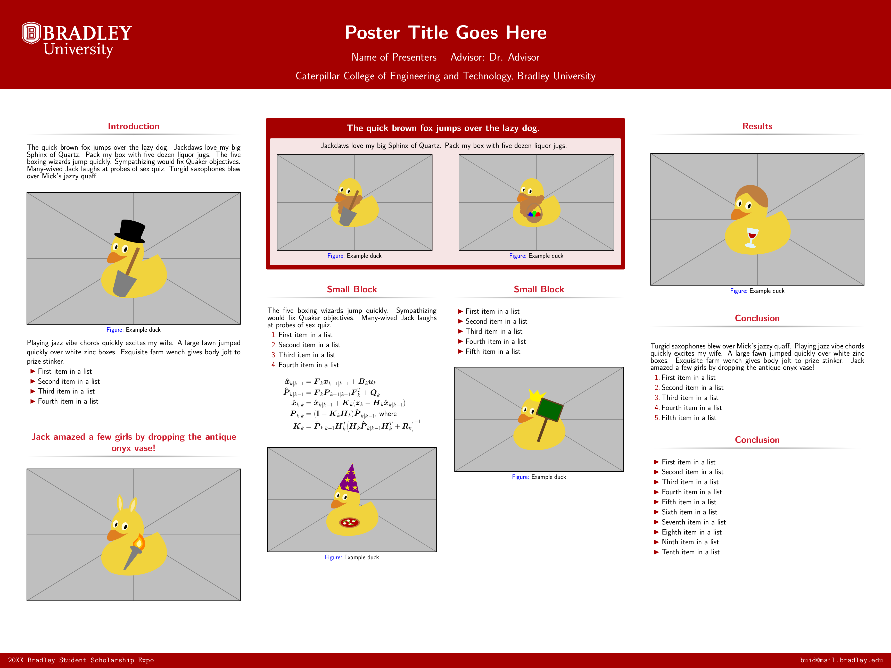

# Poster template for Bradley University



## Usage

Example poster see `example.tex`.
Recommend to use `latexmk`

```bash
latexmk example.tex
```

## Acknowledgement

This template is modified from the [RicePoster](https://dainachiba.github.io/RiceBeamer/) posted by Rice University.
The original work was inspired by Nathaniel Johnston's [poster template](https://www.nathanieljohnston.com/2009/08/latex-poster-template/).
